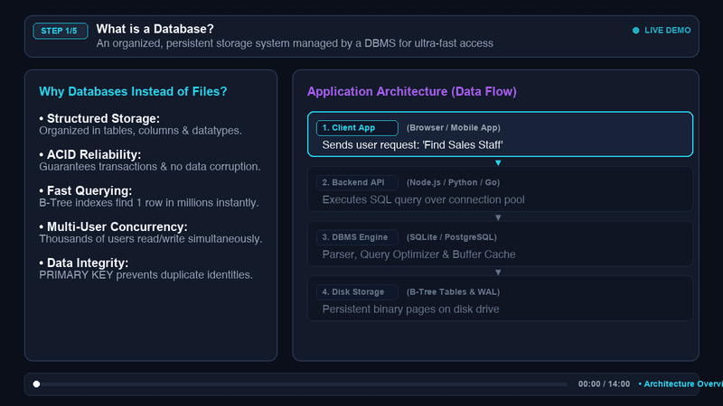

# What is a Database? | SQL Storage & Retrieval Visualizer 🎬📊

An interactive, visual demonstration and animated video guide answering:
> **"What is a Database? Explain how data is stored and retrieved in applications."**

---

## 🎥 Video Demonstration



*The animation shows the end-to-end flow: Table creation schema blueprint, inserting records into storage pages, and executing `SELECT * WHERE dept = 'Sales'` with predicate evaluation.*

---

## 📚 What is a Database?

A **database** is an organized, persistent collection of structured data managed by a **Database Management System (DBMS)** such as PostgreSQL, MySQL, SQLite, or Oracle.

### Why Applications Use Databases (vs. Flat Files / RAM):
1. **Persistence:** Data survives application restarts, crashes, and server reboots.
2. **ACID Guarantees:** Ensures Atomicity, Consistency, Isolation, and Durability so transactions never leave corrupted data.
3. **High-Speed Querying:** Uses B-Tree and hash indexes to search millions of rows in sub-milliseconds ($O(\log N)$ instead of reading whole files from start to finish).
4. **Concurrency:** Thousands of users can read and write data simultaneously with row/table locking.
5. **Data Integrity:** Enforces data types, constraints (`NOT NULL`), and unique identifiers (`PRIMARY KEY`).

---

## 🌐 How Data is Stored and Retrieved in Applications

```
+------------------+         HTTP / JSON Request         +-------------------+
|  1. Client App   | ---------------------------------> |   2. Backend API  |
| (Web/iOS/Android)| <--------------------------------- | (Node/Python/Go)  |
+------------------+         Structured JSON Data       +-------------------+
                                                                  |
                                                         SQL Query / Pool
                                                                  v
+------------------+         Binary Pages / WAL          +-------------------+
| 4. Disk Storage  | <--------------------------------- | 3. Database Engine|
| (B-Trees / SSD)  | ---------------------------------> |(Parser & Optimizer|
+------------------+          Fast Block Read           +-------------------+
```

1. **Client Interaction:** A user clicks a button (e.g. *"Show Sales Team"*). The browser/mobile app dispatches an HTTP GET request to the backend API (`/api/employees?dept=Sales`).
2. **Backend Server:** The server authenticates the request, validates parameters, and sends an SQL query to the database engine over a connection pool.
3. **Database Engine:**
   - **Parser & Planner:** Validates SQL syntax and creates an optimal execution plan.
   - **Buffer Pool & Cache:** Checks if relevant table pages are already in memory.
   - **Storage Engine:** Reads the table pages from non-volatile storage (SSD) and filters rows matching the condition (`dept = 'Sales'`).
4. **Delivery:** The database returns matching row tuples to the server, which converts them to JSON and delivers them to the client interface for display.

---

## 🛠️ Step-by-Step SQL Execution

### Step 1: CREATE TABLE
Defines the schema structure, column types, and integrity constraints.

```sql
CREATE TABLE EMPLOYEE (
  empId INTEGER PRIMARY KEY,
  name TEXT NOT NULL,
  dept TEXT NOT NULL
);
```

- `empId INTEGER PRIMARY KEY`: Uniquely identifies each employee, automatically indexed to prevent duplicates.
- `name TEXT NOT NULL`: Requires a non-empty name for every employee.
- `dept TEXT NOT NULL`: Requires a department designation.

---

### Step 2: INSERT INTO (Storing Data)
Writes new binary records into database storage pages.

```sql
INSERT INTO EMPLOYEE VALUES (0001, 'Clark', 'Sales');
INSERT INTO EMPLOYEE VALUES (0002, 'Dave', 'Accounting');
INSERT INTO EMPLOYEE VALUES (0003, 'Ava', 'Sales');
```

**Table Storage State:**

| empId (PK) | name | dept | Storage Page |
| :---: | :---: | :---: | :---: |
| `0001` | **Clark** | Sales | Page #1 (0x7F01) |
| `0002` | **Dave** | Accounting | Page #1 (0x7F02) |
| `0003` | **Ava** | Sales | Page #1 (0x7F03) |

---

### Step 3: SELECT (Querying & Retrieving Data)
Fetches records matching the specified criteria.

```sql
SELECT * FROM EMPLOYEE WHERE dept = 'Sales';
```

**Query Engine Row Scan & Evaluation:**
- Row 1: `Clark (Sales)` -> `dept == 'Sales'` -> **MATCH (Include) ✔**
- Row 2: `Dave (Accounting)` -> `dept != 'Sales'` -> **NO MATCH (Discard) ✖**
- Row 3: `Ava (Sales)` -> `dept == 'Sales'` -> **MATCH (Include) ✔**

**Final Result Set Returned:**

| empId | name | dept |
| :---: | :---: | :---: |
| `1` | **Clark** | **Sales** |
| `3` | **Ava** | **Sales** |

---

## 🚀 Running the Project Locally

### 1. Launch the Interactive Web Visualizer
You can view and play with the interactive SQL visualizer and tour:

```bash
# Using Python
python3 -m http.server 4321

# Or with Node.js
npx serve .
```

Open your browser at: **`http://localhost:4321`**

### 2. Generate the Video Animation
To regenerate the animated WebP and GIF video:

```bash
# Setup virtual environment
python3 -m venv .venv
source .venv/bin/activate
pip install pillow imageio numpy

# Run video generator
python generate_video.py
```

---

## 📂 Project Structure

```
├── README.md               # Documentation, architecture guide & demo
├── index.html              # Interactive Web Visualizer & Tour
├── style.css               # Modern dark-mode styling & glassmorphism
├── app.js                  # SQL simulator engine & animation controller
├── generate_video.py       # Script to render animated tutorial video frames
├── database_tutorial.gif   # High-definition animated demonstration video (GIF)
├── database_tutorial.webp  # High-definition animated demonstration video (WebP)
└── .gitignore              # Ignores venv and temp database files
```
